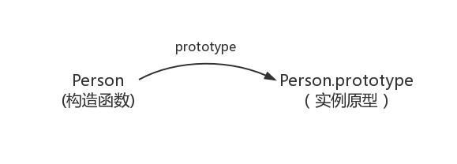
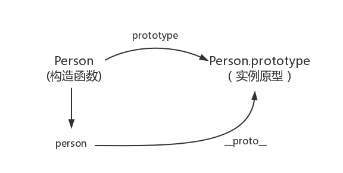
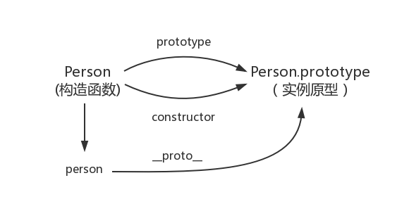
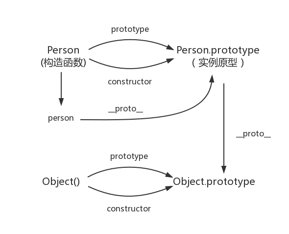
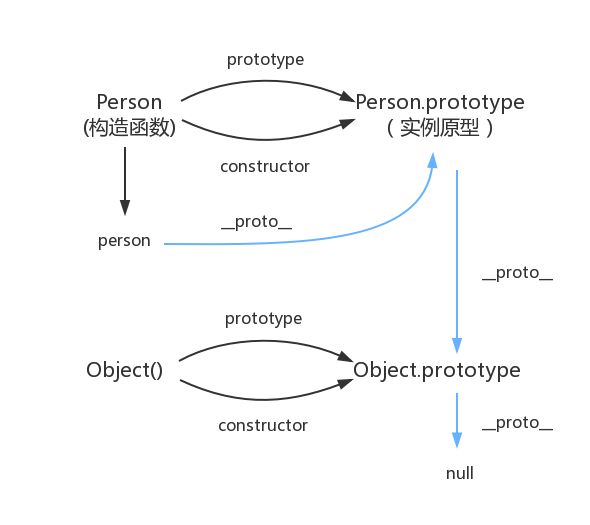

# JavaScript深入之从原型到原型链

## 构造函数创建对象

我们先使用构造函数创建一个对象：

```js

function Person() {

}
var person = new Person();
person.name = 'name';
console.log(person.name) // name

```

在这个例子中，Person就是一个构造函数，我们使用new创建了一个实例对象person。

很简单吧，接下来进入正题：

## prototype

每个函数都有一个prototype属性，就是我们经常在各种例子中看到的那个prototype，比如：

```js

function Person() {

}
// 虽然写在注释里，但是你要注意：
// prototype是函数才会有的属性
Person.prototype.name = 'name';
var person1 = new Person();
var person2 = new Person();
console.log(person1.name) // name
console.log(person2.name) // name

```

那这个函数的prototype属性到底指向的是什么呢？是这个函数的原型吗？

其实，函数的prototype属性指向了一个对象，这个对象正是调用该构造函数而创建的**实例**的原型,也就是这个例子中的person1和person2的原型。

那么什么是原型呢？你可以这样理解：每一个JavaScript对象(null除外)在创建的时候就会与之关联另一个对象，这个对象就是我们所说的原型，每一个对象都会从原型"继承"属性。

让我们用一张图表示构造函数和实例原型之间的关系：



在这张图中我们用Object.prototype表示实例原型

那么我们该怎么表示实例与实例原型，也就是person和Person.prototype之间的关系呢，这时候我们就要讲到第二个属性：

## \_\_proto\_\_

这是每一个JavaScript对象(除了null)都具有的一个属性，叫\_\_proto\_\_，这个属性会指向该对象的原型。

为了证明这一点,我们可以在火狐或者谷歌中输入：

```js
function Person() {

}
var person = new Person();
console.log(person.__proto__ === Person.prototype); //true
```

于是我们更新下关系图：



既然实例对象和构造函数都可以指向原型，那么原型是否有属性指向构造函数或者实例呢？

## constructor

指向实例倒是没有，因为一个构造函数可以生成多个实例，但是原型指向构造函数倒是有的，这就要讲到第三个属性：construcotr，每个原型都有一个constructor属性指向关联的构造函数

为了验证这一点，我们可以尝试：

```js
function Person() {

}
console.log(Person === Person.prototype.constructor); //true
```

所以再更新下关系图：



综上我们已经得出：

```js
function Person() {
}

var person = new Person();

console.log(person.__proto__ == Person.prototype) // true
console.log(Person.prototype.constructor == Person) // true
// 顺便学习一个ES5的方法,可以获得对象的原型
console.log(Object.getPrototypeOf(person) === Person.prototype) //true

```

了解了构造函数、实例原型、和实例之间的关系，接下来我们讲讲实例和原型的关系：

## 实例与原型

当读取实例的属性时，如果找不到，就会查找与对象关联的原型中的属性，如果还查不到，就去找原型的原型，一直找到最顶层为止。

举个例子：

```js

function Person() {

}

Person.prototype.name = 'name';

var person = new Person();

person.name = 'name of this person';
console.log(person.name) // name of this person

delete person.name;
console.log(person.name) // name

```

在这个例子中，我们设置了person的name属性，所以我们可以读取到为'name of this person'，当我们删除了person的name属性时，读取person.name，从person中找不到就会从person的原型也就是person.\_\_proto\_\_ == Person.prototype中查找，幸运的是我们找到了为'name'，但是万一还没有找到呢？原型的原型又是什么呢？

在前面，我们已经讲了原型也是一个对象，既然是对象，我们就可以用最原始的方式创建它，那就是

```js

var obj = new Object();
obj.name = 'name'
console.log(obj.name) // name

```

所以原型对象是通过Object构造函数生成的，结合之前所讲,实例的\_\_proto\_\_指向构造函数的prototype,所以我们再更新下关系图：



## 原型链

那Object.prototype的原型呢？

null，嗯，就是null,所以查到Object.prototype就可以停止查找了

所以最后一张关系图就是



顺便还要说一下，图中由相互关联的原型组成的链状结构就是原型链，也就是蓝色的这条线。

## 补充

最后，补充和纠正本文中一些不严谨的地方：

首先是constructor,
```js
function Person() {

}
var person = new Person();
console.log(person.constructor === Person); // true
```

当获取person.constructor时，其实person中并没有constructor属性,当不能读取到constructor属性时，会从person的原型也就是Person.prototype中读取，正好原型中有该属性，所以

```js
person.constructor === Person.prototype.constructor
```

其次是\_\_proto\_\_, 绝大部分浏览器都支持这个非标准的方法访问原型，然而它并不存在与Person.prototype中，实际上，它是来自于Object.prototype，与其说是一个属性，不如说是一个getter/setter，当使用obj.\_\_proto\_\_时，可以理解成返回了Object.getPrototypeOf(obj)

最后是关于继承，前面我们讲到“每一个对象都会从原型"继承"属性”,实际上，继承是一个十分具有迷惑性的说法，引用《你不知道的JavaScript》中的话，就是:继承意味着复制操作，然而JavaScript默认并不会复制对象的属性，相反，JavaScript只是在两个对象之间创建一个关联，这样，一个对象就可以通过委托访问另一个对象的属性和函数，所以与其叫继承，委托的说法反而更准确些。

## 更多

JavaScript深入系列的更多文章可以在 [https://github.com/mqyqingfeng/Blog](https://github.com/mqyqingfeng/Blog) 查看