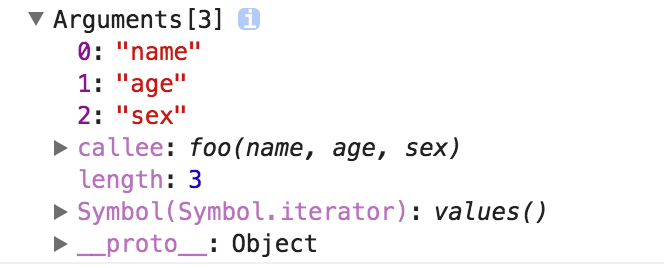

# JavaScript深入之类数组对象与arguments

所谓的类数组对象:

>拥有一个 length 属性和若干索引属性的对象

举个例子：

```js
var array = ['name', 'age', 'sex'];

var arrayLike = {
    0: 'name',
    1: 'age',
    2: 'sex',
    length: 3
}
```

即便如此，为什么叫做类数组对象呢？

那让我们从读写、获取长度、遍历三个方面看看这两个对象

## 读写

```js
console.log(array[0]); // name
console.log(arrayLike[0]); // name

array[0] = 'new name';
arrayLike[0] = 'new name';
```

## 长度

```js
console.log(array.length); // 3
console.log(arrayLike.length); // 3
```

## 遍历

```js
for(var i = 0, len = array.length; i < len; i++) {
   ……
}
for(var i = 0, len = arrayLike.length; i < len; i++) {
    ……
}
```

是不是很像？

那类数组对象可以使用数组的方法吗？比如：

```js
arrayLike.push('4');
```

但是上述代码会报错: arrayLike.push is not a function

所以终归还是类数组呐……

那如果类数组就是想用数组的方法怎么办呢？

既然无法直接调用，那就用Function.call间接调用：

```js
var arrayLike = {0: 'name', 1: 'age', 2: 'sex', length: 3 }

Array.prototype.join.call(arrayLike, '&'); // name&age&sex

Array.prototype.slice.call(arrayLike, 0); // ["name", "age", "sex"] 
// slice可以做到类数组转数组

Array.prototype.map.call(arrayLike, function(item){
    return item.toUpperCase();
}); 
// ["NAME", "AGE", "SEX"]
```

在上面的例子中已经提到了一种类数组转数组的方法，再补充两个：

```js
var arrayLike = {0: 'name', 1: 'age', 2: 'sex', length: 3 }
// 1. slice
Array.prototype.slice.call(arrayLike); // ["name", "age", "sex"] 
// 2. splice
Array.prototype.splice.call(arrayLike, 0); // ["name", "age", "sex"] 
// 3. ES6 Array.from
Array.from(arrayLike); // ["name", "age", "sex"] 
```

那么为什么会讲到类数组对象呢？以及类数组有什么应用吗？

要说到类数组对象，Arguments对象就是一个类数组对象。在客户端JavaScript中，一些DOM方法(document.getElementsByTagName())也返回类数组对象。

接下来重点讲讲Arguments对象。

Arguments对象只定义在函数体内，包括了函数的参数和其他属性。

举个例子：

```js
function foo(name, age, sex) {
    console.log(arguments);
}

foo('name', 'age', 'sex')
```

打印结果如下：



我们可以看到除了类数组的索引属性和length属性之外，还有一个callee属性，指向了当前正在执行的函数，通过它可以引用匿名函数自身。

接下来讲讲arguments对象的几个注意要点：

1.arguments转数组

上面讲的方法都可以

2. 修改arguments

```js
function foo(name, age, sex, hobbit) {

    console.log(name, arguments[0]); // name name

    name = 'new name';

    console.log(name, arguments[0]); // new name new name

    arguments[1] = 'new age';

    console.log(age, arguments[1]); // new age new age

    console.log(sex); // undefined

    sex = 'new sex';

    console.log(sex, arguments[2]); // new sex undefined

    arguments[3] = 'new hobbit';

    console.log(hobbit, arguments[3]); // undefined new hobbit

}

foo('name', 'age')
```

传入的参数，实参和arguments的值会共享，当没有传入时，实参与arguments值不会共享

除此之外，以上是在非严格模式下，如果是在严格模式下，实参和arguments是不会共享的。

3.将参数从一个函数传递到另一个函数

```js
function foo() {
    bar.apply(this, arguments);
}
function bar(a, b, c) {
    // logic
}
```

4. ES6使用...运算符

```js
function func(...arguments) {
    console.log(arguments); // [1, 2, 3]
}

func(1, 2, 3);
```
